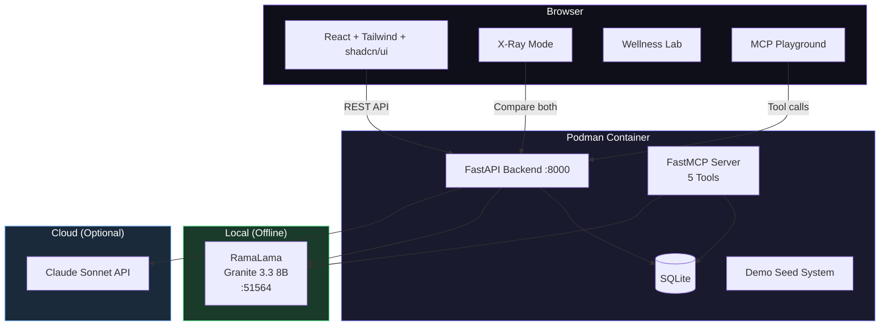

<p align="center">
  
  
  
  
  
  
  
</p>

<h1 align="center">YU Shield</h1>
<p align="center"><strong>Prevention, Not Treatment.</strong></p>
<p align="center">AI-powered employee wellbeing platform — local-first, privacy-first, containerized with Podman.</p>

<p align="center">
  <a href="#x-ray-mode">X-Ray Mode</a> · <a href="#mcp-tools">MCP Tools</a> · <a href="#employer-dashboard">Employer Dashboard</a> · <a href="#quick-start">Quick Start</a>
</p>

---

## The Problem

Employee burnout costs U.S. employers **$125–190 billion annually**. Current solutions (EAPs, wellness apps) are reactive — they wait for employees to self-refer after a crisis. Only 3–5% of employees ever use them.

## The Solution

YU Shield uses behavioral intelligence to detect burnout signals **before** they become crises. Through a 30-second daily check-in, YU builds a personal behavioral baseline for each employee. When patterns shift — not a bad day, but sustained deviation over 3+ days — YU's AI delivers personalized, CBT-informed micro-interventions grounded in the employee's actual data.

---

## Architecture



---

## Key Features

### X-Ray Mode

Side-by-side comparison of **local AI (Granite 3.3)** vs **cloud AI (Claude)** on the same check-in. Shows response times and privacy indicators. Judges and users can see local AI is viable for enterprise wellness.

```
┌─────────────────────────┐  ┌─────────────────────────┐
│  LOCAL  Granite 3.3     │  │  CLOUD  Claude Sonnet   │
│  🔒 Data never left     │  │  ☁️ Sent to Anthropic   │
│  your device            │  │  API                     │
│                         │  │                          │
│  "Your mood dropped     │  │  "I notice your mood     │
│  from 4.2 to 2.6..."   │  │  has shifted from..."    │
│                         │  │                          │
│  ⏱️ 2.1s               │  │  ⏱️ 1.8s                │
└─────────────────────────┘  └─────────────────────────┘
```

### Drift Detection

```
Personal Baseline (7+ days)  →  Rolling 3-day Average  →  Drift Alert
     mood: 4.2                    mood: 2.3               ⚠️ -1.9 below
     energy: 4.1                  energy: 2.0              ⚠️ -2.1 below
     sleep: 4.3                   sleep: 2.0               ⚠️ -2.3 below
```

Every AI response cites **specific data points**: *"Your mood dropped from an average of 4.2 to 2.6 over the past 4 days."*

### MCP Tools

5 tools exposed via Model Context Protocol — any AI assistant can interact with YU Shield:

| Tool | Description |
|------|-------------|
| `check_my_wellness` | Employee self-service: check your own baseline, trends, drift |
| `get_team_wellness_summary` | Anonymous team aggregates (no individual data) |
| `book_wellness_activity` | Book from catalog of 17 activities |
| `get_wellness_recommendations` | Score-based activity suggestions |
| `submit_checkin` | Submit check-in and get AI coaching response |

Live interactive **MCP Playground** at `/mcp` for testing tools in real-time.

### Employer Dashboard

Privacy-first team wellness overview with:
- Wellness Score (0-100) with trend indicator
- Area charts for 14-day mood/energy/sleep trends
- Drift alert count
- Actionable insights (What's Working / Watch Areas / Recommended Actions)
- **Zero individual data** — anonymous aggregates only

### Wellness Lab

16 science-backed protocols + 5 team challenges with real study citations:
- Cold Plunge Duo (250% dopamine — Srámek et al., 2000)
- Pre-Meeting Breathwork (62% cortisol reduction — Ma et al., 2017)
- Walking 1:1 Challenge (60% more creative ideas — Stanford, 2014)
- Dopamine Fast, Digital Sunset, Phone Stack Lunch, and more

### Booking System

17 activities across 4 categories (Calm, Energize, Focus, Recovery) with named local providers, times, locations, and intensity levels. All included in YU Shield membership.

---

## Quick Start

### Option 1: Podman (Production)

```bash
# Start local AI model (via Podman AI Lab or RamaLama)
ramalama serve granite-3.3-8b-instruct

# Build & run
podman build -t yu-shield .
podman run -p 8000:8000 \
  -e RAMALAMA_URL=http://host.containers.internal:51564 \
  -e ANTHROPIC_API_KEY=sk-ant-... \
  yu-shield

# Open http://localhost:8000
```

### Option 2: Development

```bash
# Terminal 1: AI model via Podman AI Lab (port 51564)

# Terminal 2: Backend
python3 -m venv venv && source venv/bin/activate
pip install -r requirements.txt
RAMALAMA_URL=http://localhost:51564 uvicorn app.main:app --reload --port 8000

# Terminal 3: Frontend
npm install && npm run dev
# Open http://localhost:8080
```

### Load Demo Data

Click **"Load Demo Data"** on the Dashboard or MCP Playground, or:

```bash
curl -X POST http://localhost:8000/api/seed-demo
```

Creates 4 demo users with 14 days of realistic check-in data.

---

## API Endpoints

| Endpoint | Method | Description |
|----------|--------|-------------|
| `/api/users` | POST | Register user |
| `/api/checkin` | POST | Submit check-in + get AI response |
| `/api/checkin/compare` | POST | X-Ray Mode: both providers with timing |
| `/api/insights/{user_id}` | GET | AI wellness analysis |
| `/api/history/{user_id}` | GET | Check-in history + baseline |
| `/api/dashboard` | GET | Anonymous team aggregates |
| `/api/seed-demo` | POST | Load demo data |

---

## Project Structure

```
├── app/                          # Python backend
│   ├── main.py                   # FastAPI — 7 endpoints + SPA serving
│   ├── database.py               # SQLite — users, check-ins, baselines, drift, aggregates
│   ├── shield.py                 # AI engine — dual provider (RamaLama + Claude)
│   ├── mcp_server.py             # FastMCP — 5 wellness tools
│   └── seed_demo.py              # Demo data generator (4 users, 14 days)
├── src/                          # React frontend
│   ├── pages/
│   │   ├── Landing.tsx           # Hero page with partner logos
│   │   ├── Chat.tsx              # 4-tab UI: Check-in, Insights, Lab, Book
│   │   ├── Dashboard.tsx         # Employer dashboard (privacy-first)
│   │   └── MCPPlayground.tsx     # Live MCP tool testing
│   ├── components/
│   │   ├── WellnessHub.tsx       # Analytics + Wellness Lab protocols
│   │   ├── BookingInline.tsx     # Activity catalog with booking
│   │   └── BookingModal.tsx      # Modal booking with 17 activities
│   └── lib/
│       └── api.ts                # API client (7 endpoints)
├── Dockerfile                    # Multi-stage: Node build → Python runtime
├── requirements.txt              # FastAPI, FastMCP, Anthropic, etc.
├── .env.example                  # Environment variable template
└── LICENSE                       # MIT
```

---

## Privacy

> **YU Shield never shares individual employee data with employers.**
>
> All individual data stays with the employee. The employer dashboard shows **only anonymized team-level aggregates**. No names, no individual scores, no check-in notes. Employees own their data — period.
>
> With RamaLama, the AI runs entirely on-device — data never leaves the machine.

---

## Tech Stack

| Layer | Technology |
|-------|-----------|
| **Container** | Podman (multi-stage Dockerfile) |
| **Local AI** | RamaLama + IBM Granite 3.3 8B Instruct |
| **Cloud AI** | Claude Sonnet 4 (Anthropic) |
| **MCP** | FastMCP (5 tools) |
| **Backend** | FastAPI + SQLite + Python 3.12 |
| **Frontend** | React 18 + Vite + TypeScript + Tailwind + shadcn/ui |
| **Charts** | Recharts |
| **Dev Tools** | Claude Code, Lovable, Podman Desktop |

---

## Ethical Design

- **Privacy by design**: Individual data never exposed to employers
- **Personalization with constraints**: Baseline requires 7+ days before recommendations activate
- **Grounded outputs**: Every AI claim cites specific data points
- **Uncertainty flagging**: AI never makes clinical claims, frames as wellness support
- **Employee data ownership**: Users can view and control their own data

---

<p align="center">
  <strong>Built for the Pods, Prompts & Prototypes Hackathon 2026</strong><br/>
  <sub>Omar Dominguez · MIT Sloan Fellows MBA '26</sub><br/>
  <sub>AI-assisted development with Claude Code</sub>
</p>

<p align="center">
  
  
  
  
</p>
