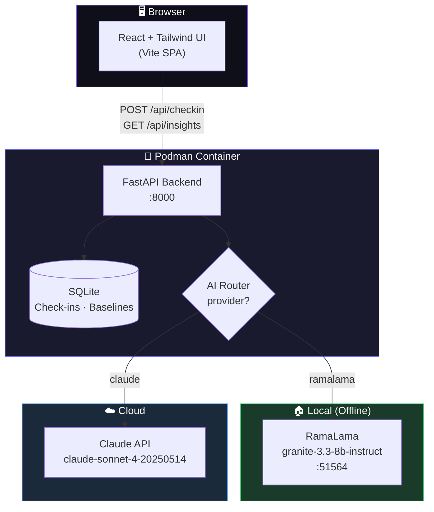

<p align="center">
  
  
  
  
  
</p>

<h1 align="center">🛡️ YU Shield</h1>
<p align="center"><strong>Prevention, Not Treatment</strong></p>
<p align="center">AI-powered employee wellness companion — fully containerized, runs local or cloud.</p>

---

## Architecture



## How It Works

```
Employee Check-in → Baseline Builder → Drift Detection → AI Intervention
     (1-5 scale)      (7+ days)        (3-day window)    (CBT-informed)
```

| Step | What happens |
|------|-------------|
| **Check-in** | Employee rates mood, energy, sleep (1-5) + optional note |
| **Baseline** | After 7 check-ins, personal averages are calculated |
| **Drift Detection** | If last 3 days drop 1.5+ below baseline → alert triggered |
| **Intervention** | AI delivers personalized, data-cited wellness message |
| **Insights** | On-demand AI summary with pattern analysis |

## Quick Start

```bash
# 1. Start local AI model
ramalama serve granite-code

# 2. Build & run with Podman
podman build -t yu-shield .
podman run -d --name yu-shield \
  -p 8000:8000 \
  -e RAMALAMA_URL=http://host.containers.internal:51564 \
  -e ANTHROPIC_API_KEY=sk-ant-... \
  yu-shield

# 3. Open
open http://localhost:8000
```

## API

| Endpoint | Method | Description |
|----------|--------|-------------|
| `/api/users` | POST | Register employee |
| `/api/checkin` | POST | Submit mood/energy/sleep (1-5) + provider |
| `/api/insights/{user_id}` | GET | AI wellness insight with baseline & drift |
| `/api/history/{user_id}` | GET | Full check-in history |

## Project Structure

```
├── app/                    # Python backend
│   ├── main.py             # FastAPI routes + SPA serving
│   ├── database.py         # SQLite: users, check-ins, baselines, drift
│   └── shield.py           # AI engine (RamaLama + Claude dual provider)
├── src/                    # React frontend (Lovable design)
│   ├── pages/
│   │   ├── Landing.tsx     # Hero page
│   │   ├── Chat.tsx        # Check-in chat UI + insights tab
│   │   └── Dashboard.tsx   # Employer aggregate view
│   └── lib/
│       └── api.ts          # API client
├── Dockerfile              # Multi-stage: Node build → Python runtime
└── requirements.txt
```

## Privacy

> All individual data stays with the employee.
> Employers only see **anonymous team-level aggregates**.
> No names, no individual scores, no tracking.

## Stack

| Layer | Tech |
|-------|------|
| **Container** | Podman |
| **Local AI** | RamaLama + granite-3.3-8b-instruct |
| **Cloud AI** | Claude API (Anthropic) |
| **Backend** | FastAPI + SQLite |
| **Frontend** | React + Vite + Tailwind + shadcn/ui |
| **Dev** | Claude Code + Podman MCP |

---

<p align="center"><sub>Built at the Podman Hackathon 2026 · AI-assisted development with Claude Code</sub></p>
